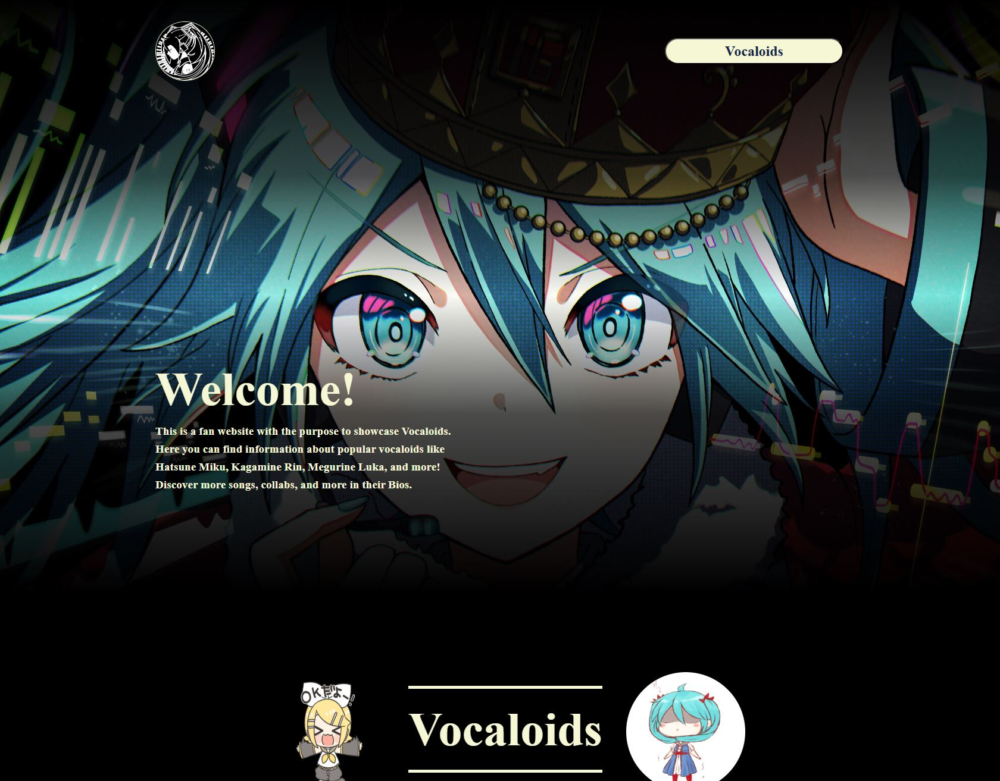
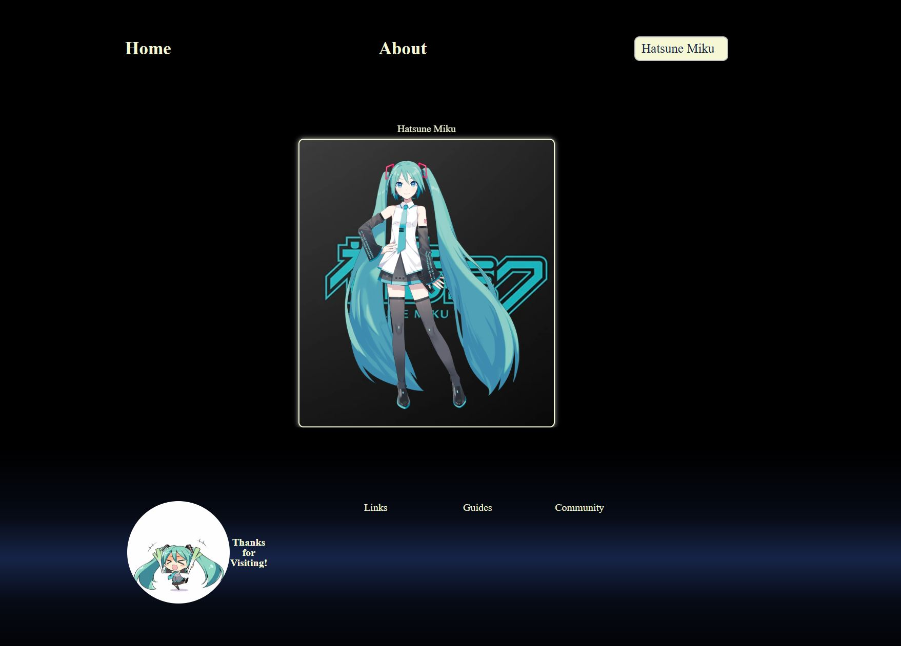
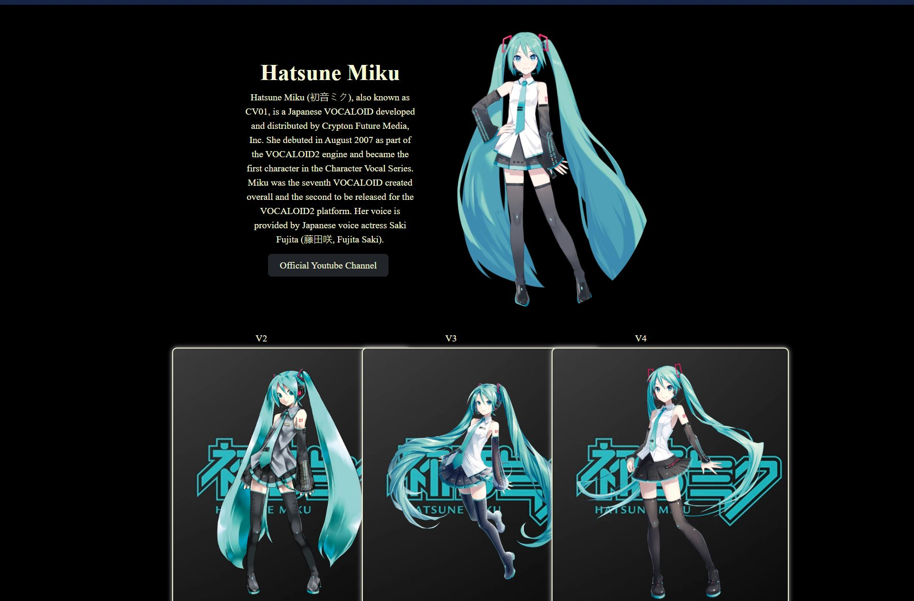

# Vocaloid Fan Page

## Description

Welcome to this fan made Vocaloid webpage, a dedicated space for fans of Vocaloid music and culture! This webpage is designed to celebrate the diverse world of Vocaloids, their unique histories, and their contributions to the music industry. Whether you're a long-time fan or new to the Vocaloid scene, this page offers an immersive experience to explore and learn more about your favorite virtual singers.

## Table of Contents
- [Description](#description)
- [Credits](#credits)
- [License](#license)
- [Technology](#technology)
- [Reflection](#reflection)

## Hero Section

## Vocaloid Carousel
This Carousel will auto scroll to the next vocaloid card.
Please Note: The only page available to view/select in this carousel is Hatsune Miku. Clicking on Luka, Rin, and IA will not lead to their respecive content pages.

## Vocaloid Content Page

## Credits

Mark Sianipar

## Technology

This webpage was built primarily using HTML and CSS. Various components were implemented by using Bootstrap CSS. All images, gifs, and music are to be credited to their respective creators. Website developed and designed by Mark Sianipar

## Reflection
a. During the planning stage, there were no significant issues, and I was on track to complete the assignment within the given class period. However, I found the process unenjoyable and decided to pivot to something more engaging. Through this pivot, I learned that shifting focus inherently creates time constraints. As a result, I chose to concentrate the majority of my effort on one key element—the landing page—to ensure it was something I could be confident in. This approach let me focus on perfecting the landing page first, then allocate thoughtful effort to lower-priority pages while still meeting my minimum viable product goals. In hindsight, I could have planned for potential pivots by building in more flexibility to accommodate changes without compromising time or quality

b. Aside from the pivot, there were no major issues in completing this assignment.

c. Given I had the urge to change in the middle of the project, I'm content with the current layout of my webpage. However I will add the remaining pages for the rest of the cast and implement more working links.

d. Make a wireframe that complies with the requirements of the assignment, and create another wireframe that does the same but with a bit more creativity.

## License

None